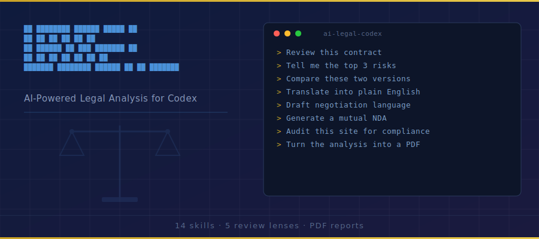

<p align="center">
  
</p>

# AI Legal Codex

<p align="center">
  <strong>AI-powered contract review and legal document generation.</strong> Review contracts, flag risks,<br/>
  generate NDAs, check compliance, negotiate terms, and produce client-ready PDF reports — all from Codex.
</p>

<p align="center">
  Every contract has hidden risks. This tool finds them in 60 seconds.
</p>

<p align="center">
  <strong>Install once, then ask Codex to review contracts in plain English.</strong>
</p>

---

## Why This Matters

| Metric | Value |
|--------|-------|
| Average legal review cost | $300–$500/hour |
| Basic contract review | $1,500–$3,000 |
| Freelancers who don't read contracts | 82% |
| Cost of one bad clause | $10,000+ |
| Small businesses without legal review | 67% |
| Time to review with this tool | Under 60 seconds |

---

## Quick Start

```bash
git clone https://github.com/pa4uslf/ai-legal-codex.git
cd ai-legal-codex
./install.sh
```

This installs all skills into `~/.codex/skills` and the full-review analysis frameworks into `~/.codex/agents`.

You can also install locally:

```bash
./install.sh
```

After installation, restart Codex.

If you want PDF export, also install:

```bash
pip3 install reportlab
```

---

## How To Use In Codex

Use natural-language prompts in Codex:

```text
Review ./msa.pdf and tell me the top 3 legal risks.
Generate a mutual NDA between Acme and Beta for partnership talks.
Audit https://example.com for GDPR and CCPA compliance gaps.
```

Recommended workflow:

1. Ask Codex for a full contract review and risk summary
2. Ask Codex to draft negotiation language for the risky clauses
3. Ask Codex to turn the latest analysis into a polished PDF

---

## All 14 Capabilities

### Contract Analysis
| What To Ask Codex | What It Does |
|---------|-------------|
| “Review this contract and give me a full risk report.” | **Flagship** — Full contract review across 5 legal analysis lenses. Returns a Contract Safety Score, clause-by-clause analysis, and prioritized recommendations. |
| “Analyze the risk level of every clause in this contract.” | Deep risk analysis with severity scoring for every clause. Estimates financial exposure. |
| “Compare these two contract versions and tell me what changed.” | Side-by-side comparison of two contract versions. Flags additions, removals, and dangerous changes. |
| “Translate this contract into plain English.” | Translates every clause from legalese into plain English anyone can understand. |
| “Draft negotiation language for the risky clauses in this contract.” | Generates specific counter-proposals with replacement language for every unfavorable clause. |
| “Tell me what protections are missing from this contract.” | Finds protections that SHOULD be in the contract but aren't. |

### Document Generation
| What To Ask Codex | What It Does |
|---------|-------------|
| “Generate a mutual NDA for these two parties.” | Generates a custom NDA — mutual, one-way, employee, or vendor. |
| “Generate terms of service for this website: [url].” | Generates terms of service based on what the website actually does. GDPR/CCPA compliant. |
| “Generate a privacy policy for this website: [url].” | Generates a privacy policy by scanning what data the site collects. |
| “Draft a freelancer agreement / MSA / SOW / partnership agreement.” | Generates business agreements — freelancer contracts, partnerships, SOWs, MSAs, and more. |
| “Review this contract from the freelancer’s perspective.” | Specialized review from the freelancer's perspective. Flags common contractor traps. |

### Compliance & Reporting
| What To Ask Codex | What It Does |
|---------|-------------|
| “Audit this website for compliance gaps: [url].” | Compliance gap analysis — GDPR, CCPA, ADA, PCI-DSS, CAN-SPAM, SOC 2. |
| “Turn the latest legal analysis into a PDF report.” | Professional PDF report with score gauges, risk charts, and prioritized actions. |

---

## What You Get

- `Contract Safety Score`: Quickly shows whether a contract looks safe enough to keep moving forward
- `Clause-by-Clause Analysis`: Explains what each clause means, why it matters, and how to improve it
- `Missing Protections`: Highlights the key safeguards the contract does not include
- `Negotiation Priorities`: Ranks the most important changes to negotiate first
- `PDF Report`: Produces a polished deliverable for clients, founders, or internal teams

---

## The Flagship: Full Contract Review

The most powerful workflow. Ask Codex to review any contract and get:

1. **Contract Safety Score** (0-100) with letter grade
2. **Risk Dashboard** — high/medium/low risk clause counts
3. **Clause-by-Clause Analysis** — every clause scored, explained in plain English, with specific fix recommendations
4. **Missing Protections** — what should be there but isn't
5. **Obligations Timeline** — every deadline and consequence mapped
6. **Compliance Flags** — regulatory issues flagged
7. **Negotiation Priorities** — ranked list of what to change first
8. **Next Steps** — actionable checklist

### How It Works

```text
Review my-contract.pdf and produce a full legal risk report with a contract safety score.
```

The Codex version runs the full review through 5 analysis lenses by default. If your host environment explicitly supports parallel sub-agents, these lenses can also be delegated in parallel:

| Analysis Lens | Role | Weight |
|-------|------|--------|
| Clause Analyst | Identifies and categorizes every clause | 20% |
| Risk Assessor | Scores each clause for risk | 25% |
| Compliance Checker | Flags regulatory issues | 20% |
| Terms Mapper | Maps obligations, deadlines, and triggers | 15% |
| Recommendations Engine | Generates specific fixes | 20% |

Results are aggregated into a unified report with a single Contract Safety Score.

---

## Codex-Friendly Design

This repository is tuned specifically for Codex:

- Every skill includes Codex-compatible frontmatter
- Installation targets `~/.codex/skills`
- The PDF script and template are bundled with `legal-report-pdf`
- Full contract review runs as 5 analysis lenses by default, without requiring parallel sub-agents
- The README uses natural-language examples instead of relying on slash-command conventions

---

## Use Cases

### For Freelancers & Agencies
- Review client contracts before signing
- Generate NDAs for new client engagements
- Create statements of work with proper protections
- Offer contract review as a paid service ($500-$1,500 per review)

### For Small Businesses
- Review vendor and supplier contracts
- Generate privacy policies and terms of service
- Run compliance audits on your website
- Understand what you're actually agreeing to

### For AI Automation Agencies
- Add contract review to your service offering
- Generate professional PDF reports for clients
- Offer monthly legal document management retainers
- Pair with the AI Marketing Suite and AI Sales Team

---

## Project Structure

```text
ai-legal-codex/
├── legal/
│   └── SKILL.md                    # Main orchestrator (command router)
├── skills/
│   ├── legal-review/SKILL.md       # Full contract review (5 review lenses)
│   ├── legal-risks/SKILL.md        # Deep risk analysis
│   ├── legal-compare/SKILL.md      # Contract comparison
│   ├── legal-plain/SKILL.md        # Plain English translation
│   ├── legal-negotiate/SKILL.md    # Counter-proposal generator
│   ├── legal-missing/SKILL.md      # Missing protections finder
│   ├── legal-nda/SKILL.md          # NDA generator
│   ├── legal-terms/SKILL.md        # Terms of service generator
│   ├── legal-privacy/SKILL.md      # Privacy policy generator
│   ├── legal-agreement/SKILL.md    # Business agreement generator
│   ├── legal-compliance/SKILL.md   # Compliance gap analysis
│   ├── legal-freelancer/SKILL.md   # Freelancer contract review
│   └── legal-report-pdf/SKILL.md   # PDF report generator
├── agents/
│   ├── legal-clauses.md            # Clause analysis framework
│   ├── legal-risks.md              # Risk assessment framework
│   ├── legal-compliance.md         # Compliance check framework
│   ├── legal-terms.md              # Terms & obligations framework
│   └── legal-recommendations.md    # Recommendations framework
├── scripts/
│   └── generate_legal_pdf.py       # PDF generation (ReportLab)
├── templates/
│   └── contract-review-template.md # Report template
├── install.sh                      # One-line installer
├── uninstall.sh                    # Clean uninstaller
└── README.md
```

---

## Requirements

- **Codex**
- **Python 3.8+** (for PDF generation only)
- **reportlab** — `pip3 install reportlab` (for PDF generation only)

---

## Uninstall

```bash
git clone https://github.com/pa4uslf/ai-legal-codex.git
cd ai-legal-codex
./uninstall.sh
```

Or run locally:

```bash
./uninstall.sh
```

---

## Disclaimer

This tool is for educational and informational purposes only. It does **not** provide legal advice and should **not** be used as a substitute for consultation with a licensed attorney. Always have a qualified lawyer review any contract before signing.

Do not rely on AI-generated output as your final legal position in employment, fundraising, M&A, privacy, regulatory, or other high-stakes matters.

---

<p align="center">
  <strong>Part of the Codex Skills Series</strong><br>
  <a href="https://github.com/zubair-trabzada/ai-marketing-claude">AI Marketing Suite</a> ·
  <a href="https://github.com/zubair-trabzada/ai-sales-team-claude">AI Sales Team</a> ·
  <strong>AI Legal Codex</strong>
</p>

<p align="center">
  <a href="https://www.skool.com/aiworkshop">🎓 Learn How to Sell Codex Services to Real Businesses</a>
</p>
